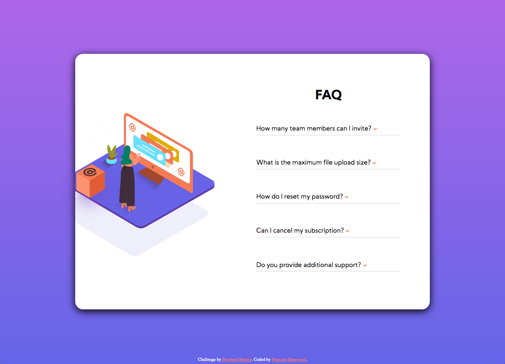

# Frontend Mentor - FAQ accordion card solution

This is a solution to the [FAQ accordion card challenge on Frontend Mentor](https://www.frontendmentor.io/challenges/faq-accordion-card-XlyjD0Oam). Frontend Mentor challenges help you improve your coding skills by building realistic projects. 

## Table of contents

- [Overview](#overview)
  - [The challenge](#the-challenge)
  - [Screenshot](#screenshot)
  - [Links](#links)
- [My process](#my-process)
  - [Built with](#built-with)
  - [What I learned](#what-i-learned)
  - [Continued development](#continued-development)
  - [Useful resources](#useful-resources)
- [Author](#author)


**Note: Delete this note and update the table of contents based on what sections you keep.**

## Overview

### The challenge

Users should be able to:

- View the optimal layout for the component depending on their device's screen size
- See hover states for all interactive elements on the page
- Hide/Show the answer to a question when the question is clicked

### Screenshot



### Links

- Solution URL: [https://github.com/hexachordal/faq-accordion-card-main](https://github.com/hexachordal/faq-accordion-card-main)
- Live Site URL: [https://hexachordal.github.io/faq-accordion-card-main/](https://hexachordal.github.io/faq-accordion-card-main/)

## My process

### Built with

- Semantic HTML5 markup
- SASS
- CSS Grid
- Mobile-first workflow
- Javascript


### What I learned

I tried really hard to do the accordion without JavaScript but did not want to use the "input" approach. It was fun learning how to code my animations in JavaScript and watch them interact with CSS. Here's a snippet:

```css
@keyframes arrDown {
    0% {
      -webkit-transform: rotateX(0deg);
              transform: rotateX(0deg);
    }
    100% {
      -webkit-transform: rotateX(180deg);
              transform: rotateX(180deg);
    }
  }
```

```js
for (let i = 0; i < q.length; i++) {
    q[i].onclick = function accordion() {
        let acc = q[i].lastElementChild
        let arr = q[i].firstElementChild
        if (acc.style.animationName !== "appear") {
            acc.style.animationName = "appear"
            arr.style.animationName = "arrDown"
            q[i].style.fontWeight = "700"

        } else if (acc.style.animationName !== "disappear") {
            acc.style.animationName = "disappear"
            arr.style.animationName = "arrUp"
            q[i].style.fontWeight = "400"


        }
    };
}
```

The media queries were a bit tough especially learning how to do handle the SVG files. Eventually I encapsulated them in imgs with no src then added the src using the content property in my css file. I also learned about a good one-liner for centering elements which was a savior:

```css
place-items: center;
```

Overall, good learning! Don't want to spend too much time on this project so I can learn from other ones.


### Continued development

The main thing I want to work on is making use of the mixins in SASS as well as aligning elements for multiple screensizes in a less clunky way. Still don't feel ready for bootstrap nor do I think I would have wanted to use it for this project though it did look appealing.


### Useful resources

- [SASS](https://sass-lang.com/documentation/) - As usual, helping me learn how to write in SASS especially when it came to grid-area properties.

- [w3schools](https://www.w3schools.com/css/css_grid.asp) - A catch all for any help needs but for this particular project, I needed help with grid and it was amazing.


## Author

- Website - [Francois Harewood](https://www.github.com/hexachordal)
- Frontend Mentor - [@hexachordal](https://www.frontendmentor.io/profile/hexachordal)


